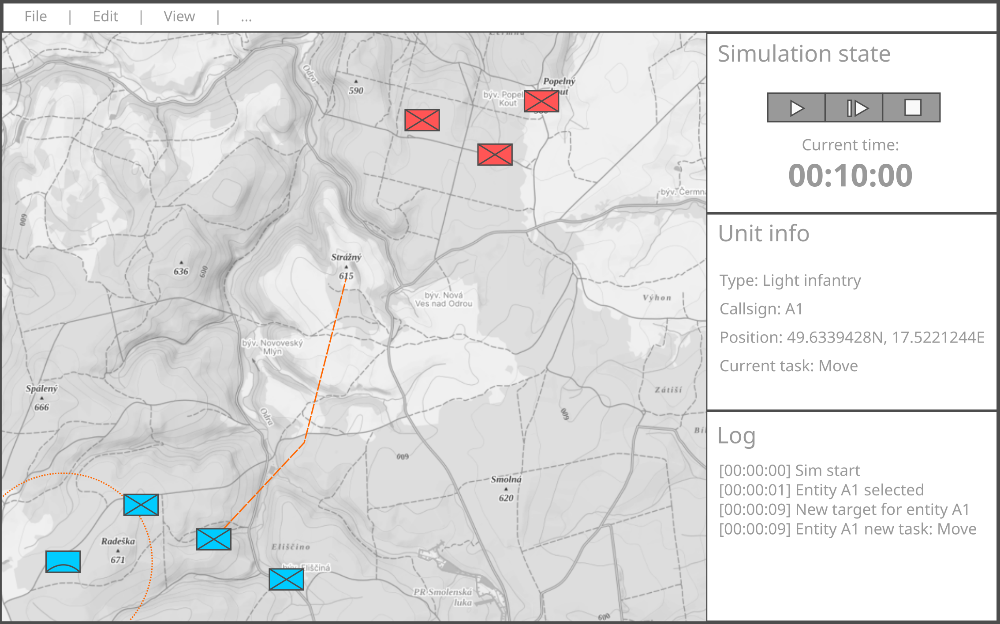

# VRG vstupní demo

Za využití libovolných frameworků, knihoven a nástrojů navrhněte a připravte rozhraní simulátoru bojových operací. Základ by měl tvořit:
- MenuBar
- Main layout (dockable view)
  - panel mapy
  - panel řízení simulace
  - panel informaci o vybrané jednotce
  - panel data-logu

Aplikace by měla implementovat:

- zobrazení mapového podkladu (např. pomocí OpenLayers - https://openlayers.org/)
- vykreslení entit v mapě (třeba jako symboly dle definice NATO - https://commons.wikimedia.org/wiki/NATO_Military_Map_Symbols)
- kliknutím na entitu v mapě:
  - zobrazit informace v panelu entity (typ, volací znak, pozice, aktuální úloha, rychlost, stav poškození, množství munice, ...)
  - vykreslit její trasu do mapy (tu lze mít libovolně staticky definovanou)
- layout umožňující dokování do flexibilních panelů (nebo jiný vhodný NE-statický layout)
- zobrazení nějakého modálního dialogu (např. měření vzdálenosti mezi dvěma entitami)
- klikatelné tlačítka řízení simulace play/pause/step/stop (jejichž akce jsou např. zapisovány do panelu data-logu)

## Smysl Vašeho dema

Není nutné připravovat pixel-perfect rozhraní, řešit všechny okrajové případy nebo ukazovat 100% znalost mapových a jiných knihoven. Není důležitý ani vzhled. Demo by mělo primárně ukazovat Vaši schopnost zorientovat se v požadovaných technologiích, zvolit ty nejvýhodnější a navrhnout s nimi dobrou architekturu celé aplikace.

## Další rozšíření

- Při spuštění se frontend-aplikace pokouší spojit s backendem přes websocket a dokud se nenačte, tak se zobrazuje loading screen.
- Backend posílá přes websocket informace o
    - nově vytvořených entitách
    - pozicích a stavu entit
    - entitách, které byly zničeny.
- Frontend posílá backendu povely pro řízení simulace (play/pause/step/stop).
- Frontend slouží k řízení pohybu entit klikáním do mapy - přidává body do naplánované trasy entity.

Pokud budete mít čas, tak v libovolné technologii implementujte jednoduchý websocket backend, který provádí některou z výše uvedených činností.
